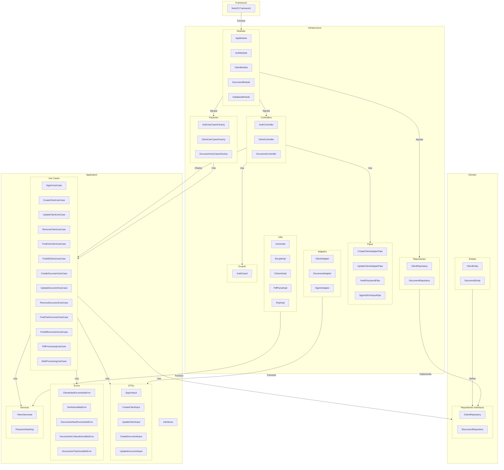

```mermaid
%% Arquitetura Clean Architecture do Projeto

flowchart TB
    %% Camadas Principais
    subgraph Domain ["Domain"]
        direction TB
        DomainEntities["Entities"]
        DomainRepositories["Repositories Interfaces"]
    end

    subgraph Application ["Application"]
        direction TB
        ApplicationUseCases["Use Cases"]
        ApplicationDTOs["DTOs"]
        ApplicationErrors["Errors"]
        ApplicationInterfaces["Interfaces"]
        ApplicationServices["Services"]
    end

    subgraph Infrastructure ["Infrastructure"]
        direction TB
        InfrastructureControllers["Controllers"]
        InfrastructureAdapters["Adapters"]
        InfrastructurePipes["Pipes"]
        InfrastructureRepositories["Repositories"]
        InfrastructureUtils["Utils"]
        InfrastructureModules["Modules"]
        InfrastructureGuards["Guards"]
        InfrastructureFactories["Factories"]
    end

    subgraph Framework ["Framework"]
        direction TB
        FrameworkNestJS["NestJS Framework"]
    end

    %% Relacionamentos entre Camadas
    DomainEntities -->|Define| DomainRepositories
    ApplicationUseCases -->|Usa| DomainRepositories
    ApplicationUseCases -->|Usa| ApplicationDTOs
    ApplicationUseCases -->|Usa| ApplicationErrors
    ApplicationUseCases -->|Usa| ApplicationServices
    InfrastructureControllers -->|Chama| ApplicationUseCases
    InfrastructureControllers -->|Usa| InfrastructurePipes
    InfrastructureControllers -->|Usa| InfrastructureGuards
    InfrastructureAdapters -->|Converte| ApplicationDTOs
    InfrastructureRepositories -->|Implementa| DomainRepositories
    InfrastructureFactories -->|Cria| ApplicationUseCases
    InfrastructureModules -->|Agrupa| InfrastructureControllers
    InfrastructureModules -->|Agrupa| InfrastructureRepositories
    InfrastructureModules -->|Agrupa| InfrastructureFactories
    InfrastructureUtils -->|Fornece| ApplicationServices
    FrameworkNestJS -->|Fornece| InfrastructureModules

    %% Componentes Detalhados
    subgraph DomainEntities ["Entities"]
        ClientEntity["ClientEntity"]
        DocumentEntity["DocumentEntity"]
    end

    subgraph DomainRepositories ["Repositories Interfaces"]
        IClientRepository["IClientRepository"]
        IDocumentRepository["IDocumentRepository"]
    end

    subgraph ApplicationUseCases ["Use Cases"]
        SignInUseCase["SignInUseCase"]
        CreateClientUseCase["CreateClientUseCase"]
        UpdateClientUseCase["UpdateClientUseCase"]
        RemoveClientUseCase["RemoveClientUseCase"]
        FindOneClientUseCase["FindOneClientUseCase"]
        FindAllClientsUseCase["FindAllClientsUseCase"]
        CreateDocumentUseCase["CreateDocumentUseCase"]
        UpdateDocumentUseCase["UpdateDocumentUseCase"]
        RemoveDocumentUseCase["RemoveDocumentUseCase"]
        FindOneDocumentUseCase["FindOneDocumentUseCase"]
        FindAllDocumentsUseCase["FindAllDocumentsUseCase"]
        PdfProcessingUseCase["PdfProcessingUseCase"]
        WebProcessingUseCase["WebProcessingUseCase"]
    end

    subgraph ApplicationDTOs ["DTOs"]
        SignInInput["SignInInput"]
        CreateClientInput["CreateClientInput"]
        UpdateClientInput["UpdateClientInput"]
        CreateDocumentInput["CreateDocumentInput"]
        UpdateDocumentInput["UpdateDocumentInput"]
    end

    subgraph ApplicationErrors ["Errors"]
        ClienteNaoEncontradoError["ClienteNaoEncontradoError"]
        SenhaInvalidaError["SenhaInvalidaError"]
        DocumentoNaoEncontradoError["DocumentoNaoEncontradoError"]
        DocumentoConteudoInvalidoError["DocumentoConteudoInvalidoError"]
        DocumentoTituloInvalidoError["DocumentoTituloInvalidoError"]
    end

    subgraph ApplicationServices ["Services"]
        TokenGenerate["TokenGenerate"]
        PasswordHashing["PasswordHashing"]
    end

    subgraph InfrastructureControllers ["Controllers"]
        AuthController["AuthController"]
        ClientController["ClientController"]
        DocumentController["DocumentController"]
    end

    subgraph InfrastructureAdapters ["Adapters"]
        ClientAdapter["ClientAdapter"]
        DocumentAdapter["DocumentAdapter"]
        SignInAdapter["SignInAdapter"]
    end

    subgraph InfrastructurePipes ["Pipes"]
        CreateClientAdapterPipe["CreateClientAdapterPipe"]
        UpdateClientAdapterPipe["UpdateClientAdapterPipe"]
        HashPasswordPipe["HashPasswordPipe"]
        SignInDtoToInputPipe["SignInDtoToInputPipe"]
    end

    subgraph InfrastructureRepositories ["Repositories"]
        ClientRepository["ClientRepository"]
        DocumentRepository["DocumentRepository"]
    end

    subgraph InfrastructureUtils ["Utils"]
        AxiosImpl["AxiosImpl"]
        BcryptImpl["BcryptImpl"]
        CheerioImpl["CheerioImpl"]
        PdfParseImpl["PdfParseImpl"]
        RxjsImpl["RxjsImpl"]
    end

    subgraph InfrastructureModules ["Modules"]
        AppModule["AppModule"]
        AuthModule["AuthModule"]
        ClientModule["ClientModule"]
        DocumentModule["DocumentModule"]
        DatabaseModule["DatabaseModule"]
    end

    subgraph InfrastructureGuards ["Guards"]
        AuthGuard["AuthGuard"]
    end

    subgraph InfrastructureFactories ["Factories"]
        AuthUseCasesFactory["AuthUseCasesFactory"]
        ClientUseCasesFactory["ClientUseCasesFactory"]
        DocumentUseCasesFactory["DocumentUseCasesFactory"]
    end
```
